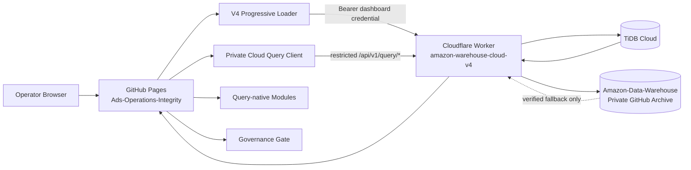

# Ads Operations Integrity

Amazon Ads 运营决策、数据完整性与执行治理前端。

这是一个部署在 **GitHub Pages** 的静态应用，但它并不是“纯本地报表工具”。当前生产模式由浏览器前端、Amazon-Data-Warehouse Cloudflare Worker 与 TiDB query plane 共同组成：

- **GitHub Pages**：发布 UI、query client、治理模块与本地分析代码。
- **Cloudflare Worker**：私有数据 API、鉴权、Query-first bootstrap、分页查询与 Raw 访问入口。
- **TiDB Cloud**：实际在线 catalog / Raw / facts / current views / aggregate queries。
- **Amazon-Data-Warehouse Private GitHub Repository**：由 Worker 管理的受治理 archive，不由本前端直接访问。

生产页面：`https://mrtanshiyue.github.io/Ads-Operations-Integrity/`  
生产 Warehouse API：`https://amazon-warehouse-cloud-v4.tanshiyuesir.workers.dev`  
V4 loader：`assets/private-cloud-warehouse-v4.js`（loader `4.3.0`）  
Query client：`assets/private-cloud-query-v1.js`（client `1.3.0`）

---

## 1. 系统定位

Ads-Operations-Integrity 的职责不是保存 Amazon 数据，也不是直接操作数据库。它的职责是：

1. 把 Warehouse 的受治理数据转化为运营分析、趋势、竞价决策和导出工作流。
2. 优先使用 TiDB 服务端聚合/分页查询，避免首屏加载完整历史 CSV。
3. 当用户明确需要深度分析时，再渐进加载受验证 Raw 明细。
4. 把“源数据是否足以支持执行”作为强制治理门禁，而不是把缺失字段默认为可执行。
5. 保持静态站点自身无数据库 secret、无 GitHub private token、无持久化明文访问密码。

它是 **Warehouse 的受控消费端 + 决策/执行治理层**。

---

## 2. 生产架构



### 最重要的边界

**本仓库不直接连接 TiDB。**

`DATABASE_URL` 只存在于 Warehouse Worker / deployment secret boundary。浏览器只能调用 Worker 提供的受控 API。

**本仓库也不直接读取 Amazon-Data-Warehouse private archive。**

需要 Raw 时，浏览器请求 Worker；Worker 决定从 TiDB 主存储读取，或在 recovery 情况下从 GitHub archive 校验后回填。

---

## 3. 页面加载策略：Query-first Progressive

V4 生产 loader 不再把“连接云端”等同于“下载完整历史”。

### 第一步：连接云端概览

点击连接后：

```text
GET /api/v1/health
        ↓
GET /api/v1/query/bootstrap
        ↓
可选 GET /api/v1/summary
        ↓
展示 TiDB server-side overview / coverage / dataFingerprint
```

首屏明确区分：

- **服务端聚合已经就绪**
- **Raw 明细尚未加载**

因此“页面已经显示经营 KPI”不代表浏览器已经拥有所有月度明细。

### 第二步：按需加载明细

生产 UI 支持：

- 最新月明细
- 近 3 月明细
- 完整历史
- 代码侧自定义月份范围

Loader 先请求 filtered manifest，再只下载对应月份、受治理且可导入的数据文件。

默认 Raw fetch concurrency 为 `1`，以降低浏览器、Worker 与大文件数据库读取的并发压力。

### 第三步：Query-native 深度分析

对于可以直接由 TiDB facts/views 回答的模块，优先走：

- `/api/v1/query/overview`
- `/api/v1/query/ads`
- `/api/v1/query/transactions`

分页上限由 client 与 Warehouse 双方限制为 `500` rows/page。

---

## 4. Data Fingerprint 与缓存语义

Warehouse bootstrap 返回 deterministic `dataFingerprint`。页面用它判断：

- 当前 scope 是否变化；
- Warehouse current files 是否变化；
- 已加载的浏览器 Raw 数据是否已经 stale。

如果店铺切换或 fingerprint 变化，旧 Raw 状态会被标记为过期，不允许继续假装是当前数据。

Query client 对稳定查询使用 Worker 返回的 ETag：

```text
If-None-Match → 304 → reuse in-memory response cache
```

这类缓存只用于相同查询结果复用，不改变 Warehouse 的 current-slot 语义。

---

## 5. Cloud credential 模型

访问 Warehouse 时，V4 loader 通过页面 prompt 获取 dashboard password，并发送：

```http
Authorization: Bearer <dashboard credential>
```

credential 只保存于当前页面 JavaScript memory：

- 不写 `localStorage`
- 不写 `sessionStorage`
- 不写 IndexedDB
- 不进入 URL
- 不进入 GitHub Pages source

刷新/关闭页面后需要重新建立凭证状态。

Query client 本身不接收密码参数；它只能调用 V4 loader 暴露的受限 query bridge。该 bridge 只接受 `/api/v1/query/` 路径，从而避免 query-native module 任意构造其他 API origin/path。

---

## 6. Query-native 模块体系

生产 query client 动态加载版本化模块：

```text
private-cloud-query-v1.js
├── query-native-module-data-v1.js
├── query-native-ads-source-readiness-v1.js
├── query-native-bid-intelligence-v1.js
├── query-native-governance-gate-v1.js
├── bid-governance-parity-audit-v1.js
├── query-native-ads-trend-v1.js
└── query-native-ads-trend-host-v1.js
```

### `query-native-module-data-v1.js`

负责把 Warehouse query response 适配到页面模块的数据接口，并维护 query-native / explicit Raw compatibility 边界。

### `query-native-ads-trend-v1.js`

负责广告趋势查询、展示与来源语义；不能因为页面需要某个指标就虚构 attribution window 等源事实。

### `query-native-bid-intelligence-v1.js`

在受治理的 Ads source contract 上构建竞价分析；其结果能否进入执行流程还要经过 governance gate。

### `query-native-ads-source-readiness-v1.js`

检查广告源字段/identity/语义是否足以支撑下游模块。

### `bid-governance-parity-audit-v1.js`

用于验证 query-native 数据与既有决策语义之间的 parity，而不是允许前端绕过 Warehouse source evidence。

---

## 7. Source-proven Governance Gate

页面中的广告竞价与 Campaign Studio 不是“按钮能点就执行”。

`query-native-governance-gate-v1.js` 会从 Warehouse `/query/ads` response 读取 `ads-query-governance-v2` readiness，并对受治理动作执行拦截。

### Bid readiness 需要的证据

包括：

- targeting identity 已验证；
- bid source column 已验证；
- bid NULL / zero semantics 可信；
- ad product source 可用；
- advertised product identity 可用；
- attribution maturity 可用。

### Campaign Studio readiness

同样要求 source-proven identity / product / attribution evidence。

如果条件不满足：

```text
UI action
  ↓
Governance Gate refresh
  ↓
Warehouse source-proven readiness
  ↓
blocked + explicit reasons
```

不能通过客户端默认值、推测 attribution window、伪造 targeting identity 等方式把 blocked 状态变成 ready。

---

## 8. Advertising Source Preflight

前端可以把待导入广告报表的 headers 发送到：

```text
GET /api/v1/query/ads/source-preflight
```

headers 在客户端完成规范化与边界检查，再通过受限 header 编码发送。

Preflight 是 **只读契约检查**：

- 不写 facts；
- 不改变 Warehouse current slot；
- 不授权竞价执行；
- 只回答当前 header 是否满足 Warehouse 的 source contract。

因此“文件能识别”与“数据足够授权执行”是两个不同层级。

---

## 9. Raw 兼容加载

某些页面深度分析仍需要 CSV 级明细。V4 loader 的 Raw 流程为：

```text
query/bootstrap
      ↓
filtered manifest
      ↓
明确选择月份范围
      ↓
GET Worker /raw/...
      ↓
检查 response metadata / length / digest contract
      ↓
导入页面分析数据
```

Raw 数据来源仍由 Warehouse 决定：正常情况下是 TiDB verified content；archive fallback 完全封装在 Worker 内。

浏览器不应该根据 GitHub repository path 自行拼接下载 URL。

---

## 10. Browser-side cache

V4 loader 使用 IndexedDB cache 保存的是 **immutable file data/cache artifacts**，不是访问密码。

缓存命中必须建立在内容 identity / fingerprint / manifest metadata 上。若 Warehouse fingerprint 变化，页面把旧 Raw 数据标记 stale，并要求重新加载适用范围。

这是性能缓存，不是数据 authority。

---

## 11. V3 compatibility 文件的真实作用

`assets/private-cloud-warehouse-v3.js` 仍存在，但它不是独立的生产数据实现。

它只是兼容旧 HTML 引用的 bootstrap：

```text
private-cloud-warehouse-v3.js
        ↓
load private-cloud-warehouse-v4.js
        ↓
warehouse-v4-production
```

生产实现的单一事实源是 V4 loader。CI 同时验证 V3 compatibility bootstrap 最终指向 V4，并拒绝 canary/旧版本重新成为生产路径。

---

## 12. 静态站安全模型

本仓库是 public GitHub Pages，因此安全模型必须假设所有前端代码都可被任何人读取。

### 允许公开的

- UI code
- query contract code
- Worker public origin
- schema/version identifiers
- vendor libraries

### 绝不能进入 Pages 的

- `DATABASE_URL`
- GitHub private repository token
- PII hash secret
- dashboard password
- TiDB credential
- Cloudflare API token

### CSP 与依赖隔离

生产页面使用 same-origin-first CSP：

- `script-src 'self'`
- 禁止 script attributes
- `object-src 'none'`
- `connect-src` 只允许 self 与生产 Warehouse Worker

第三方 JS 依赖 vendored 到 `assets/vendor/`，并由 `scripts/vendor-lock.json` 的 SHA-256 进行 CI 校验。生产页面不依赖运行时 CDN fallback。

---

## 13. 仓库结构

```text
.
├── index.html                         # 主应用 UI / legacy integrated application logic
├── assets/
│   ├── private-cloud-warehouse-v4.js # 生产 Warehouse progressive loader
│   ├── private-cloud-warehouse-v3.js # compatibility bootstrap → V4
│   ├── private-cloud-query-v1.js     # restricted query client
│   ├── query-native-*.js             # query-native analytics/governance modules
│   ├── bid-governance-parity-audit-v1.js
│   ├── generated/                     # hardened externalized inline scripts
│   └── vendor/                        # pinned browser dependencies
├── scripts/
│   ├── harden-static-site.mjs
│   ├── test-progressive-loader.mjs
│   ├── test-query-native-modules.mjs
│   ├── test-query-native-ads-trend.mjs
│   ├── test-query-native-governance-gate.mjs
│   ├── test-bid-governance-parity-audit.mjs
│   └── vendor-lock.json
├── docs/archive/                      # historical release evidence, not runtime authority
└── .github/workflows/
    ├── ci-main.yml
    └── pages.yml
```

---

## 14. 与 Amazon-Data-Warehouse 的接口契约

### Ads-Operations-Integrity 依赖 Warehouse 提供

- health / version / capability contract
- Query-first bootstrap
- current file coverage
- deterministic data fingerprint
- TiDB query status
- overview aggregate
- paginated ads / transactions
- filtered manifest
- verified Raw response
- ads source preflight
- ads governance readiness

### Ads-Operations-Integrity 不拥有

- report activation
- `report_slots`
- source / serving SHA authority
- sanitization rules
- TiDB schema migration
- archive hydration
- Raw read-time digest verification

这些都属于 Warehouse。

---

## 15. Scope / Store 模型

前端统一使用：

- `ALL`
- `YTDBNS`
- `YY`
- `JJ`

切换 scope 会使依赖旧 scope 的 bootstrap/governance/Raw 状态失效或重新校验。任何模块都不应把某个店铺的 cached data 静默复用到另一个 scope。

---

## 16. GitHub Pages 发布

`main` 是源码生产分支；GitHub Pages 实际从 `gh-pages` 发布。

`pages.yml` 执行：

```text
checkout exact main commit
→ build complete static artifact
→ extract/validate maintained scripts
→ progressive/query-native tests
→ production loader invariants
→ publish exact validated artifact to gh-pages
```

`gh-pages` 是部署产物分支，不是日常开发源分支。

---

## 17. Pull Request CI

`Validate Front-end Main` 在 PR / main 验证：

- maintained JavaScript syntax；
- Query-first progressive loading contract；
- Query-native module contract；
- Ads trend semantics；
- vendor SHA-256 lock；
- same-origin CSP / no remote executable dependency；
- V4 loader version和唯一生产引用；
- query bridge 路径限制；
- memory-only credential；
- Raw fetch concurrency / retry contract；
- governance / attribution 不得用默认值绕过；
- transient repair artifacts 与意外 workflow 不得留在生产树；
- Pages artifact 必须包含完整应用资产。

README 或 UI 修改也应通过 PR，让这些生产不变量继续自动验证。

---

## 18. 本地验证

本仓库没有传统 bundler build 才能运行的后端；主要验证由 Node.js 脚本完成。

```bash
node --check assets/private-cloud-warehouse-v4.js
node --check assets/private-cloud-query-v1.js
node scripts/test-progressive-loader.mjs
node scripts/test-query-native-modules.mjs
node scripts/test-query-native-ads-trend.mjs
```

如需本地打开页面，应通过 HTTP server，而不是依赖 `file://` 行为：

```bash
python3 -m http.server 8000
```

Warehouse Worker 允许的本地开发 origins 包括 `http://localhost:8000` 与 `http://127.0.0.1:8000`。

---

## 19. 不可降低的生产不变量

1. **No direct TiDB from browser**：前端不持有 DB credential。
2. **No direct private GitHub archive access**：浏览器不持有 Warehouse GitHub token。
3. **Memory-only dashboard credential**：不得恢复 local/session storage 明文密码持久化。
4. **V4 is production path**：compatibility bootstrap 不能重新分叉出独立旧数据实现。
5. **Query path restriction**：Query-native client 只能通过受控 bridge 调 `/api/v1/query/*`。
6. **Data fingerprint invalidation**：scope/current data 变化后旧 Raw 不能继续当 current 使用。
7. **Source-proven governance**：竞价/Campaign 执行不能用 guessed/default source semantics 解锁。
8. **Attribution honesty**：源报表未提供可验证 attribution evidence 时，UI 必须显示 unavailable，而不是假定 7/14/30 天。
9. **Vendor integrity**：公开静态依赖继续由本地 pinned bytes + SHA-256 lock 管理。
10. **PR + CI + exact Pages artifact**：生产前端变更通过独立分支、CI 和 gh-pages 发布链进入生产。

---

## 20. 设计判断

这个仓库应该被理解为 **Amazon-Data-Warehouse 之上的运营决策应用层**：

```text
Amazon source reports
      ↓
Amazon-Data-Warehouse ingestion / sanitization / SHA-256 / current-slot
      ↓
TiDB online warehouse
      ↓
Cloudflare Worker controlled API
      ↓
Ads-Operations-Integrity Query-first / Query-native
      ↓
analysis → governance → operator action/export
```

后续优化优先级应保持：

- 首屏优先 server-side aggregate；
- 明细按需而不是默认全量；
- query-native 逐步替代不必要的 Raw browser compute；
- 大文件读取降低 Worker CPU / copy / retry amplification；
- 所有性能优化都不能牺牲 source evidence、SHA-256、credential boundary 或 execution gate。
